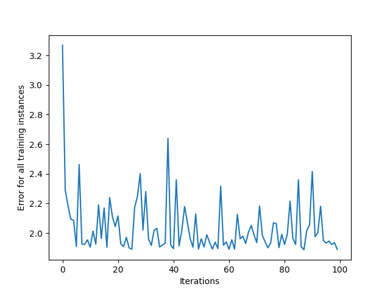

# Neural Network Training with Python

This is a simple implementation of a neural network training algorithm in Python, using Numpy and Matplotlib libraries. The code trains a neural network to predict binary targets based on input vectors, and includes visualization of training error over iterations.

## Important Variables

- `input_vectors`: A NumPy array containing the input vectors for training the neural network.
- `targets`: A NumPy array containing the corresponding target values for the input vectors.
- `learning_rate`: A float value representing the learning rate of the neural network, which determines the step size for updating the parameters during training.
- `neural_network`: An instance of the `NeuralNetwork` class, which represents the neural network model.

## Important Functions

- `_sigmoid(x)`: A private method of the `NeuralNetwork` class that calculates the sigmoid function of a given input `x`.
- `_sigmoid_deriv(x)`: A private method of the `NeuralNetwork` class that calculates the derivative of the sigmoid function with respect to a given input `x`.
- `predict(input_vector)`: A method of the `NeuralNetwork` class that predicts the output for a given input vector using the trained model.
- `_compute_gradients(input_vector, target)`: A private method of the `NeuralNetwork` class that computes the gradients of the error with respect to the parameters (bias and weights) of the neural network.
- `_update_parameters(derror_dbias, derror_dweights)`: A private method of the `NeuralNetwork` class that updates the parameters (bias and weights) of the neural network based on the computed gradients.
- `train(input_vectors, targets, iterations)`: A method of the `NeuralNetwork` class that trains the neural network using the provided input vectors and target values for a specified number of iterations, and returns the cumulative error over iterations.

## Example Usage

```python
import numpy as np
import matplotlib.pyplot as plt

# Define input vectors and targets
input_vectors = np.array([[3, 1.5], [2, 1], [4, 1.5], [3, 4], [3.5, 0.5], [2, 0.5], [5.5, 1], [1, 1]])
targets = np.array([0, 1, 0, 1, 0, 1, 1, 0])

# Set learning rate and create neural network instance
learning_rate = 0.1
neural_network = NeuralNetwork(learning_rate)

# Train the neural network
training_error = neural_network.train(input_vectors, targets, 10000)

# Plot the training error over iterations
plt.plot(training_error)
plt.xlabel("Iterations")
plt.ylabel("Error for all training instances")
plt.savefig("cumulative_error.png")
```

## Plot Examples

Below are examples of the cumulative error plot with different learning rates:

### Learning Rate = 0.5


### Learning Rate = 0.1



### Learning Rate = 0.01


For more information about neural networks, sigmoid function, and gradient descent, you can refer to the following Wikipedia pages:

- [Neural Network](https://en.wikipedia.org/wiki/Artificial_neural_network)
- [Sigmoid Function](https://en.wikipedia.org/wiki/Sigmoid_function)
- [Gradient Descent](https://en.wikipedia.org/wiki/Gradient_descent)
